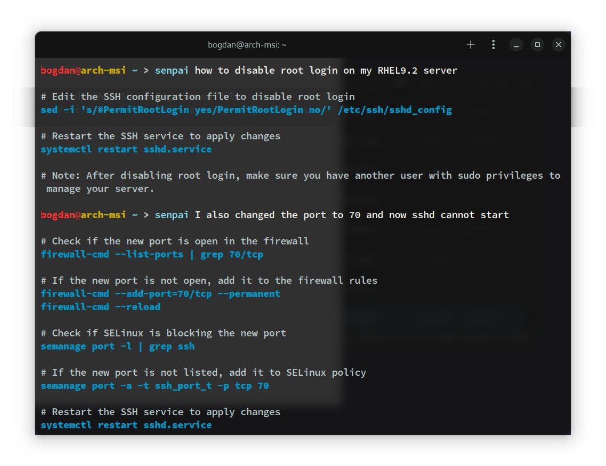

# BashSenpai

BashSenpai is a command-line tool that utilizes the power of ChatGPT, bringing it straight to your terminal. You can ask questions and receive insightful responses related to shell scripting, making it an indispensable asset for both beginners and seasoned users alike.

<div align="center">
    <br>
    
</div>
<p align="center">
    <a href="https://bashsenpai.com/"><b>BashSenpai.com</b></a>
</p>


## 🎯 Features

- Powered by ChatGPT.
- Refined prompts employing a multi-step self-reflection process for the most optimal results.
- Receive answers executable directly in the terminal, complemented with instructive comments.
- Ask follow-up questions without providing any context; our API will include your log history.
- Menu prompt after each response, enabling you to run any provided commands, or modify if needed.
- Share optional information about the OS you are using to enhance the responses for general queries.
- Nicely formatted answers with customizable colors for improved readability.
- Modify the persona of BashSenpai, adding a touch of fun and personality to your interactions.

## 📖 Table of Contents

- [Installation](#-installation)
- [Usage](#️-usage)
- [Options](#️-options)
- [Contributing](#-contributing)
- [License](#-license)
- [Roadmap](#️-roadmap)
- [Maintainers](#-maintainers)

## 💻 Installation

We ensure up-to-date packages for the following Operating Systems and Linux distributions:

### Ubuntu-based

Install from PPA:

```shell
sudo add-apt-repository ppa:bashsenpai/cli
sudo apt update
sudo apt install senpai-cli
```

Supported distributions: **Ubuntu 22.04 LTS** or later, **Linux Mint 21** or later, **Pop!_OS 22.04**, **KDE neon 5.27**, **elementary OS 7**.

### RPM-based

Install from Copr:

```shell
sudo dnf copr enable bashsenpai/cli
sudo dnf install senpai-cli
```

Supported distributions: **Fedora 38**, **RHEL 9**, **CentOS Stream 9**.

### Arch Linux-based

Install from the AUR:

```shell
yay -S senpai-cli
```

Supported distributions: any Arch-based rolling-release distribution that supports installing packages from the AUR. **Manjaro** should also work, but it's untested.

### MacOS

Install with Homebrew:

```shell
brew tap BashSenpai/core
brew install senpai-cli
```

### Windows

Download: **[Installer](https://bashsenpai.com/download/latest)**.

## ⌨️ Usage

To use BashSenpai, run the following command:

```shell
senpai [options] prompt
```

The `prompt` argument represents the question you want to ask or a special command you wish to execute. BashSenpai sends the prompt to the BashSenpai API and displays the response in your terminal.

### Examples

* Login to BashSenpai:

```shell
senpai login
```

This prompt asks you to enter an authentication token, storing it in the configuration file.

* Change the persona of BashSenpai:

```shell
senpai become angry pirate
```

This prompt alters BashSenpai's persona to an angry pirate, infusing a fun twist into the responses. You are not confined to a specific list of characters and can input anything you desire. Our ingeniously designed backend API, equipped with multi-level prompts and instructions, ensures all eccentric ideas are nicely integrated with the core functionality of the tool.

* Ask a question:

```shell
senpai how to disable SSH connections
```

This prompt sends the question to the BashSenpai API and displays an informative and well-formatted response.

* Ask for a command explanation:

```shell
senpai explain tar
```

This prompt sends a question about a specific command to the BashSenpai API and displays a list of most common use cases along with informative comments and remarks of what each one does.

## ⚙️ Options

* `--command-color`: sets the color of the commands in the responses. Valid options are: black, white, gray, red, green, yellow, blue, magenta and cyan. Brighter versions of each color are available, for example: "bright blue". You can also bold colors, for example: "bold red" or "bold bright cyan".

* `--comment-color`: sets the color of the comments in the responses.

* `--meta`, `--no-meta`: determines whether to send OS metadata to refine the responses. This includes OS type and version (all OSes), shell type (macOS and Linux), and architecture (macOS). Users may choose to disable this feature for privacy reasons, or in cases where it yields undesired results (for example if the tool is operating on a Windows machine, but the user expects answers about Linux).

* `-n, --new`: excludes any preceding history when asking a question. Use this option to initiate a new context.

* `--run`, `--no-run`: controls whether to display the menu prompt to execute each returned command.

* `-v`, `--version`: shows current version number.

Check our [Roadmap](#roadmap) section for new and upcoming features as we develop the configuration options. We are committed to making BashSenpai user-friendly, flexible, and easily-configurable, and we value your initial feedback. If you have any suggestions or feature requests, don't hesitate to use the appropriate tools provided by GitHub to share your ideas with us.

## 👥 Contributing

We warmly welcome contributions to enrich and advance the BashSenpai tool. If you have any interesting ideas, bug reports, or feature requests, please create an issue on the GitHub repository. Feel free to fork the repository, make changes, and submit pull requests.

To contribute to BashSenpai, please follow these steps:

1. Fork the repository.
2. Create a new branch for your feature or bug fix.
3. Make your changes, ensuring they do not disrupt the core functionality of the tool.
4. Commit your changes and push them to your forked repository.
5. Submit a pull request, providing a clear explanation of the changes you've made.

We appreciate your interest in BashSenpai and will do our best to review any pull requests promptly and maintain an open discussion of our feature goals to facilitate a smooth and easy contribution process for everyone involved.

## 📜 License

This project is licensed under the Apache 2.0 License. For more information, see the [LICENSE](LICENSE) file.

## 🗺️ Roadmap

### Version 0.90 (planned)
- [ ] Print current user configuration
- [ ] Text-only mode
- [ ] Provide instructions of how to update when a new version is available (based on OS)
- [ ] Generate docker compose configuration files
- [x] Generate common examples for a specific command

### Version 0.80 (finished)

- [x] Better error handling: print better output on receiving an error from the API
- [x] Additional context: provide optional information about your own environment to improve the results
- [x] Improve the formatting of the output of the CLI
- [x] Check if a new version is available

### Version 0.75 (finished)

- [x] MacOS build: proper MacOS integration
- [x] Windows build: native build script with an installer
- [x] Command execution: execute any provided list of commands directly in the terminal
- [x] Configurable color schemes: change the default colors so they fit better with your terminal configuration

### Other planned features

- [ ] Multi-language support: delivered by ChatGPT
- [ ] Alpine Linux packages
- [ ] openSUSE packages
- [ ] BSD-based distros packages
- [ ] Windows code signing

## 👨‍💻 Maintainers

This project is maintained by:

- [Bogdan Tatarov](https://github.com/btatarov)
- [Nikolay Dyankov](https://github.com/nikolaydyankov)

We welcome contributions from the community. If you have any queries, suggestions, or bug reports, please feel free to connect with any of the maintainers.
